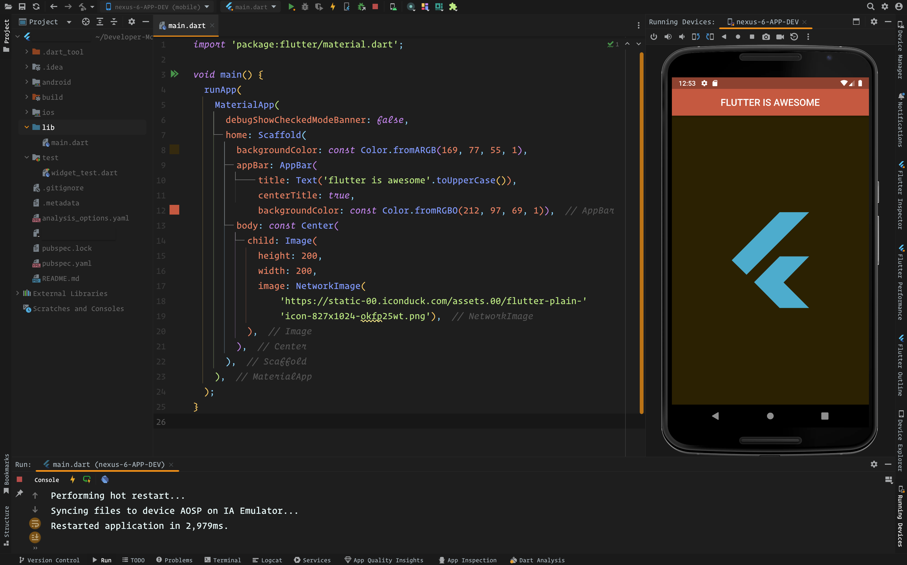

# first_flutter_app

## a new Flutter project. 📲

## app-about: ❓

    Simple Scaffold, AppBar and Image ... first time trying widgets in Flutter / Dart . 
    Excited! 🙃

## main takeaways: 🤓

- [x]  Getting to know Android Studio IDE and taking first steps in Mobile Development with Flutter.
- [x]  First impressions and feeling writing code in Dart. 👍

