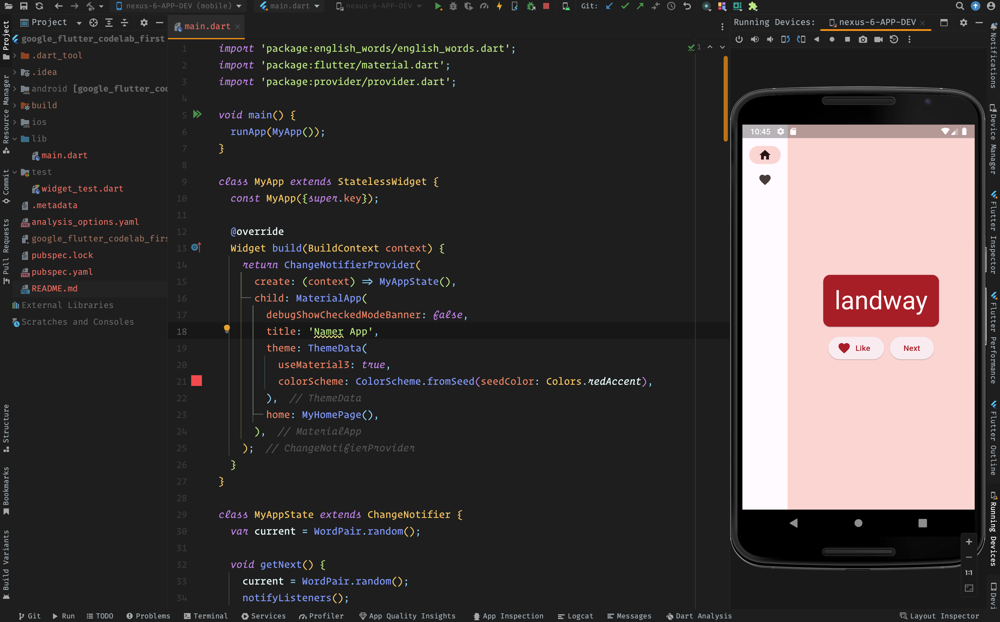
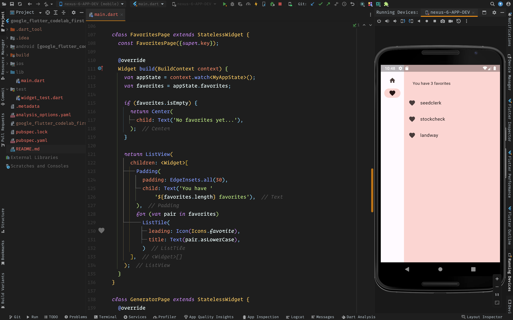

# google_codelab_namer_app

## a new Flutter project. 📲

## app-about: ❓

    The application generates cool-sounding names, such as "newstay", "lightstream", "mainbrake", or "graypine". The user can ask for the next name, favorite the current one, and review the list of favorited names on a separate page. The app is responsive to different screen sizes.

## main takeaways: 🤓

- [x]  The basics of how Flutter works

- [x] Creating layouts in Flutter

- [x] Connecting user interactions (like button presses) to app behavior

- [x] Keeping your Flutter code organized

- [x] Making your app responsive (for different screens)

- [x] Achieving a consistent look & feel of your app

