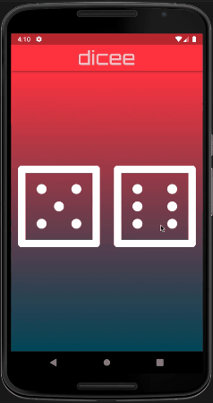
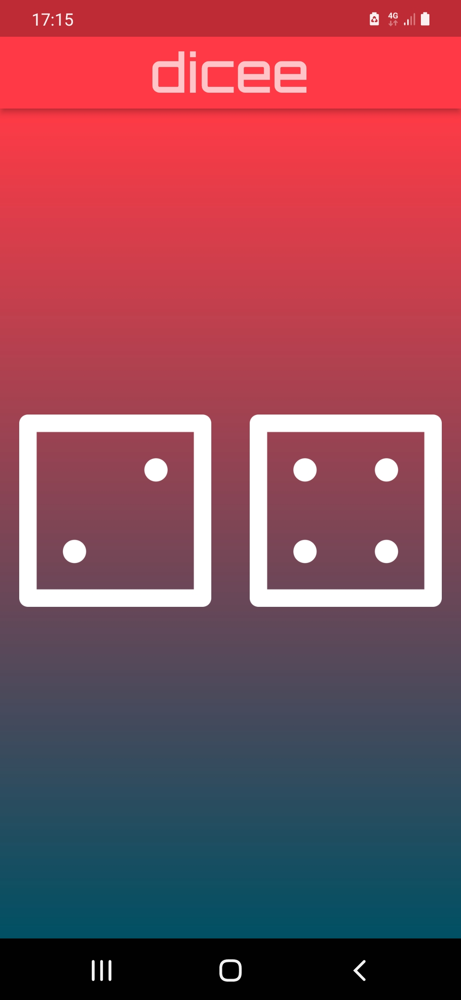

# mi-card 👔

## app-about: ❓

    This application is designed to showcase and present relevant contact information and details that in similar way is found on business card.

## tested-physical-device: 📲

    Samsung Galaxy A40

## main takeaways: 🤓

- [x] Creating layouts in Flutter

- [x] Widget properties

- [x] linking Assets

- [x] Achieving a consistent look & feel of your app

