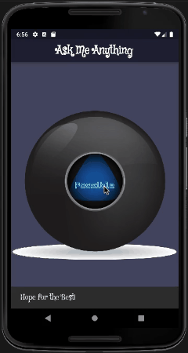

# magic-8-ball 🪄 🎱

## app-about: ❓

    This app will help You to find 'answer' to Your mysterious question.

## tested-physical-device: 📲

    Samsung Galaxy A40

## main takeaways: 🤓

- [x] Practicing creating project structure tree

- [x] Stateful Widget and setState()

- [x] Practicing Functions and app-flow logic

- [x] importing module (other .dart file) to main.dart

- [x] Practicing Responsive design (Expanded Widget)

