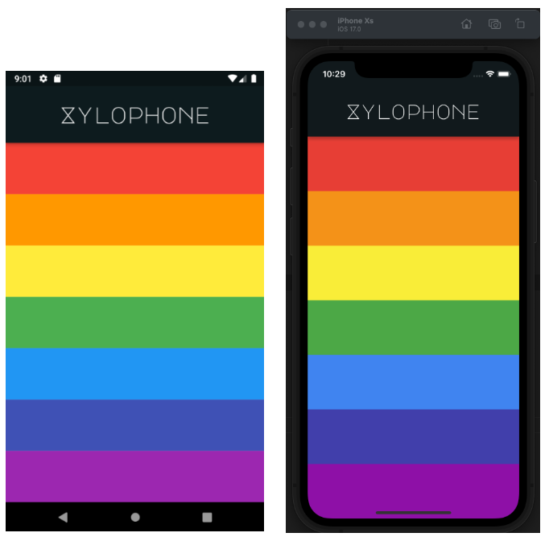

# xylophone 🎹

## app-about: ❓

    This application is a digital version of xylophone musical instrument.

## tested-physical-device: 📲

    Samsung Galaxy A40

## tested-virtual-device: 📲

    - Samsung Galaxy A40
    - iPhone XS

## main takeaways: 🤓 👍

- [x] Practicing project structure ( separating UI code from app logic and util functions )

- [x] implemwenting flutter package and setting up dependencies

- [x] Achieving a consistent look & feel of your app

 

